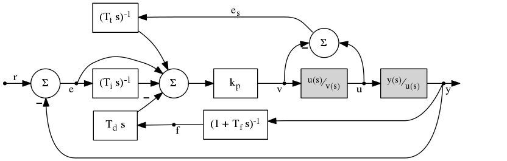

helm
====

This PID controller, implemented wholly within [helm.h], features:
 * low pass filtering of the process derivative,
 * windup protection,
 * automatic reset on actuator saturation,
 * anti-kick on setpoint change using "derivative on measurement",
 * incremental output for bumpless manual-to-automatic transitions,
 * a unified controller gain parameter,
 * exposure of all independent physical time scales, and
 * the ability to accommodate varying sample rate.

The design and nomenclature is based largely on Figure 10.11 of
[Feedback Systems](http://www.worldcat.org/isbn/9781400828739) by
Astrom and Murray.

References
----------

TODO
